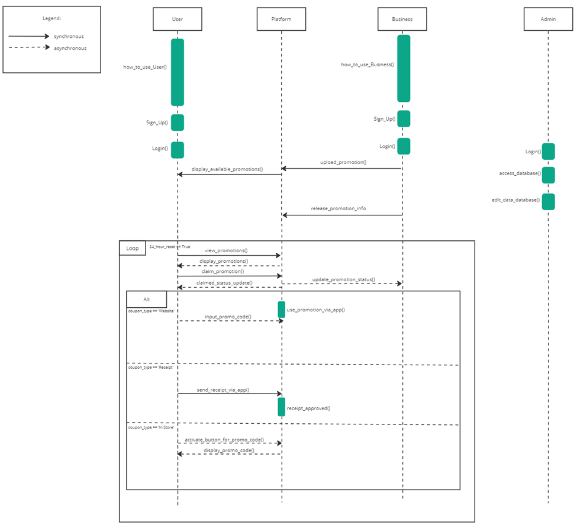
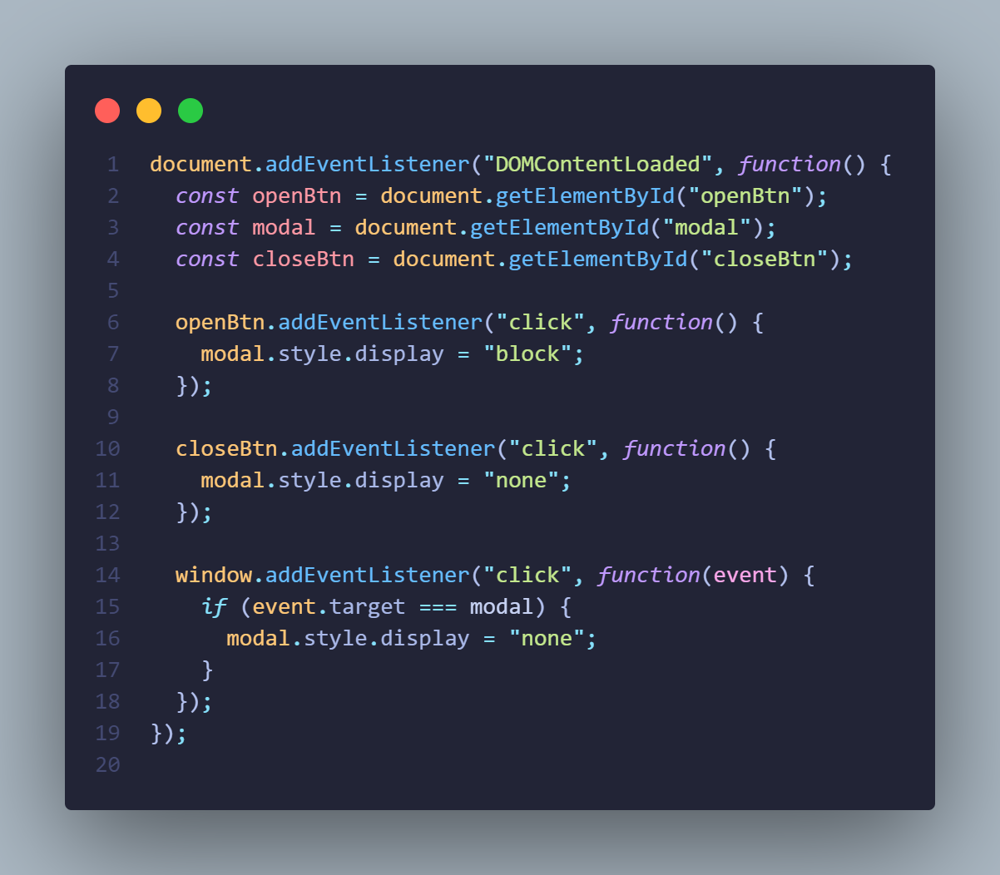

# **50.003 Elements of Software Construction**

## Features (Demo video)
https://github.com/user-attachments/assets/6dc12920-6aff-41bf-9d52-4af1d6bdf5c4

# Group Report of C2SI2

<table>
  <tr>
   <td>Name of Members
   </td>
   <td>Student ID
   </td>
  </tr>
  <tr>
   <td>Ng Zheng Wei
   </td>
   <td>1006014
   </td>
  </tr>
  <tr>
   <td>Nicholas Teng Shin Shoon
   </td>
   <td>1003416
   </td>
  </tr>
  <tr>
   <td>Alestier Kwa
   </td>
   <td>1006103
   </td>
  </tr>
  <tr>
   <td>Bondugula Varun Teja
   </td>
   <td>1005965
   </td>
  </tr>
  <tr>
   <td>Oon Shao Ren
   </td>
   <td>1005935
   </td>
  </tr>
  <tr>
   <td>Ong Jun Bin
   </td>
   <td>1005900
   </td>
  </tr>
  <tr>
   <td>Ignatius Ng Wei Yang
   </td>
   <td>1006000
   </td>
  </tr>
  <tr>
   <td>Xavier Tan Jun Han
   </td>
   <td>1005889
   </td>
  </tr>
</table>

# Description of project

Welcome to PinchPromo, your gateway to a world of exclusive benefits and unbeatable offers tailored for the vibrant community of Singapore University of Technology and Design (SUTD) students and staff. Our innovative platform is designed to elevate your daily experience by connecting you with the most enticing promotions right at your fingertips. With PinchPromo, you gain instant access to a curated selection of top-notch deals and perks from local businesses, all conveniently available through our user-friendly website. Whether you're craving delectable dining experiences, seeking exciting entertainment, or aiming to elevate your lifestyle, PinchPromo is your go-to destination for unlocking a realm of savings and delights. Join us as we redefine the way you explore and indulge, one pinch at a time.

# Section 1: Requirements

# Section 1.1: Use-case Diagrams

### User use-case diagram:

Figure 1.11: User use-case diagram

The user Use Case Diagram depicts the user journey from setting up an account to claiming a digital coupon for usage in featured stores. It also depicts the alternative paths showing other functionality like adjusting user settings and contacting the admin for enquiries or support. The ‘sort promotions’ & ‘receive notifications’ are indicated in red. This denotes features that we intend to, but have not yet implemented, since they are additional functionality that enhances the user experience but are not fundamental functions for using our application.

### Business use-case diagram:

Figure 1.12: Business use-case diagram

The Business Use Case Diagram depicts the experience of businesses checking the performance of promotions that they have posted, which will show them a dashboard displaying charts and graphs to guide them on which posts are successful and which are not for future reference. Business accounts can also toggle their settings to do tasks like changing their account password. The nodes in red are currently not implemented, which includes features to interact with users by prompting them of new promotions to increase awareness as well as request for approval for promotion posts from the administrators.

### User Misuse case diagram:

Figure 1.13: User misuse-case diagram

The user Misuse Case Diagram shows plausible harmful actions by hackers such as viewing / changing a user account’s login credentials or performing a DDOS attack, which threatens users’ account security and disrupts access to their own accounts. Prevention functionalities are encryption requests, authentication infrastructure and having steady monitoring of the network.

### Business Misuse case diagram:

Figure 1.14: Business misuse-case diagram

The Business Misuse Case Diagram depicts how hackers maliciously using / changing a Business Account’s login credentials disrupts businesses’ access to their accounts. DDOS attacks by hackers also lead to service disruption or even complete outage, which prevents businesses from logging into their account and thus disrupted operations. Proper encryption, authentication and monitoring can prevent these misuse cases from occurring.

# Section 1.2: Class Diagrams

### For Users:

Figure 1.21: User class and System Testing diagram

**User Class Diagram Description:**

The class diagram primarily revolves around the User and Promotion entities, with a strong emphasis on user authentication and promotion management.

**Authentication:** Managed by Firebase, it encompasses functionalities like login, signup, logout, password reset, email updates, password updates, and email verification.

**User:** Represents the platform's users with attributes such as UID, name, email, gender, password, promotions they've claimed, promotions they've used, and their preference for receiving email marketing.

**Promotion:** Represents the promotions available on the platform. Each promotion has a unique PID, title, description, associated business details, timing details, number of available coupons, and paths to associated media (logo and poster). There are also functionalities to claim a promotion, use a promotion, and upload a receipt for a claimed promotion.

**Storage Bucket: **Manages the storage of media, offering functionalities to upload bytes and get download URLs.

**NoSQL Database (Firestore):** Manages the data storage and retrieval with functions to create, read, and update documents.

**CypressTesting:** Represents end-to-end testing of the application. It has specific testing functionalities for both users and businesses.

### Class Diagram - Business:

Figure 1.22: Business and System Testing class diagram

**Business Class Diagram Description:**

The class diagram primarily focuses on the Business and Promotion entities, emphasising business account management and promotion handling.

**Authentication:** Managed by Firebase, it includes functionalities like login, signup, logout, password reset, email updates, password updates, and email verification. There's also a unique function for businesses to learn instructions.

**Business:** Represents businesses on the platform. Attributes include BusinessID, business name, email, password, total promotions, promotions claimed, and the time the business account was created. Functionalities include submitting new promotions, resubmitting promotions, and accessing all promotions.

**Promotion:** Represents the promotions that businesses can offer. Each promotion has attributes like PID, title, business details, timing details, number of available coupons, paths to associated media (logo and poster), and more. There are also functionalities to claim and use a promotion.

**Storage Bucket:** Manages the storage of media, offering functionalities to upload bytes and get download URLs.

**NoSQL Database (Firestore): **Manages the data storage and retrieval with functions to create, read, and update documents.

**CypressTesting:** Represents end-to-end testing of the application. It has specific testing functionalities for both users and businesses, ensuring that both sides of the platform function as expected.

# Section 1.3: Sequence Diagrams

### For User Account, Platform, Business Account, Admin Account Subsystem

Figure 1.31: User sequence diagram

Both new consumer users and businesses should take some time to learn how to use the platform. They can then sign up and log in with a new account. When any business uploads a promotion, users are able to view all new/current available promotions, the details of which may only be released at a later date. Users get a new claim to use on any promotion on a daily basis. Depending on the claimed coupon, to redeem it, users may have to input a promo code, or send a receipt, or display a promo code in-store.

### For Admin Account, Platform, Business Account Subsystem

Figure 1.32: Business sequence diagram

A business can access their dashboard to view some statistics on their promotions. If they wish to start a new promotion, they have to submit a request which will be reviewed by the admin. If approved, it will be published, made available to users and businesses will be notified. If not approved, the businesses will also be notified and can resubmit a modified promotion. The process repeats until the admin approves the latest submission (or the business does not wish to resubmit).

# Section 2: Implementation Challenges

# Section 2.1: Algorithmic challenges

### Concurrency:

To prevent the issue of concurrency and race conditions where multiple users may claim the same promotion simultaneously, we can implement locking mechanisms and proper synchronisation techniques in our ReactJS and NodeJS application using Firebase. Here's how we can address this challenge in the near future:

1. Locking Mechanism: Implement a locking mechanism on the server side to ensure that only one user can claim a promotion at a time. This prevents multiple users from claiming the same promotion simultaneously.
2. Transactional Operations: Utilise Firebase's transactional operations to ensure data consistency and prevent race conditions. Firebase provides built-in support for transactions, which allow you to update data atomically.

Server side implementation:

1. When a user initiates a promotion claim, send a request to the server.
2. In our NodeJS server, use Firebase's transactional operations to update the promotion's claim count. Transactions ensure that the update is performed atomically, preventing race conditions.
3. Check if the remaining promotion count is greater than zero. If not, return an error indicating that the promotion has been fully claimed.
4. If the transaction is successful, mark the promotion as claimed for that user and return a success response.

Client side implementation:

1. When a user initiates a claim, send a request to the server.
2. Display a loading indicator while waiting for the server's response.
3. If the server responds with a success message, update the client's state to reflect the claimed promotion.
4. If the server responds with an error indicating that the promotion has been fully claimed, show an appropriate error message to the user.

By using Firebase's transactional operations and implementing a locking mechanism on the server side, we can ensure that only one user can claim a promotion at a time, thus preventing the problem of concurrency and race conditions. This approach helps maintain data consistency and provides a reliable user experience, even as the number of users increases.

# Section 2.2: Engineering challenges

### Simplifying Front-end - Overcoming tedious HTML, CSS, JavaScript with ReactJS and Chakra UI:

In our web development journey, we faced a challenge with the old ways of using HTML, CSS, and JavaScript, which were time-consuming. To work smarter, we embraced modern tools. With [ReactJS](https://react.dev/) and "[Chakra UI](https://chakra-ui.com/)", a stylish design system, we revamped our development process. This move let us create better, more interactive user interfaces quickly. It also sped up how fast we built our app. Combining ReactJS and Chakra UI helped us break free from old techniques, leading to a better app experience overall. This strategic shift not only empowered us to craft more sophisticated and responsive user interfaces but also dramatically accelerated our development timeline. By harnessing the synergy between ReactJS and Chakra UI, we were able to transcend the constraints of outdated methods, ultimately elevating the quality and user experience of our application to new heights.

### Business Dashboard:

One of the notable challenges our team encountered centred around the conversion of data from Firebase into actionable insights tailored for our esteemed clients – the business account proprietors of PinchPromo. With this aim in mind, we embarked on the development of a comprehensive dashboard, empowering these business account owners to intuitively grasp the performance metrics of their promotions.

Initially, our choice for the business dashboard was the "[ant design](https://ant.design/)" framework – a React.js library recognized for its user-friendly components, which we seamlessly integrated into the dashboard's interface. However, we encountered an unforeseen obstacle when we noticed compatibility issues between the "ant design" library's routing mechanism and our application's routing infrastructure. In light of this, we regrettably had to abandon the utilisation of the "ant design" library.

Figure 2.21: Ant Design Dashboard

Nonetheless, we persevered in adapting the design principles and aesthetics from our original dashboard concept to our new dashboard iteration, meticulously crafted through the "[Horizon UI](https://horizon-ui.com/)" framework. The selection of "Horizon UI" was made deliberately, as it forms a subset of the well-established "Chakra UI" – a framework that we were already seamlessly integrating into our development process.

### Establishing Clear Design and Control Flow:

To effectively translate our ideas into a well-structured application, we confronted the absence of a visual representation that could anchor the design and control flow. Drawing from our experience with sequence design, which delineates interactions between user and business accounts, we forged a clearer path forward. This understanding bolstered our project's foundation, allowing us to architect a robust structure. Additionally, integrating state diagrams provided a vital compass, guiding our feature development with clarity and purpose.

### Front End Design:

We encountered the absence of an initial front-end design framework like Figma. This prompted us to adopt an alternative approach, wherein we drew inspiration from the design of established websites such as Burpple. Steering our efforts towards emulating proven templates allowed us to iteratively refine our front-end layout and user experience. While we did not use Figma to guide the front-end of this project, this adaptive strategy enabled us to craft an engaging and user-friendly interface aligned with contemporary design principles.

Figure 2.22: ReactJS & Chakra UI code for InfoModal component

Figure 2.23: HTML code for InfoModal component

Figure 2.24: CSS code for InfoModal component

Figure 2.25: JavaScript code for InfoModal component

Even with the HTML, CSS, JavaScript code for InfoModal component, it still lacks some advanced features and styles present in the original Chakra UI code.

#

# Section 2.3: Testing challenges

### Ensuring System Test robustness through structured planning:

During the system testing phase, the overarching goal was to ensure that the system tests were robust enough to validate the seamless integration of all features, effectively working together in a single session. While the user state diagrams provided a foundational reference, their level of detail wasn't sufficient to guarantee comprehensive testing. This brought about the need for a meticulous approach to overcome testing challenges.

To tackle this challenge, we formulated a structured plan closely aligned with the user state diagrams. This approach involved assessing each use case, determining the specific features implicated, and then systematically constructing the framework for system testing. By following this process, we achieved a level of assurance that no vital features were inadvertently overlooked during testing. Consequently, our system tests gained an elevated level of robustness, effectively validating the intended functionality of the system.

Figure 2.31: Snippet of the structured plan that gives more detail to ensure the system testing is comprehensive.

### Technical Complexities of Cypress

While Cypress offers user-friendly testing capabilities, it introduces complexities when dealing with multiple keywords. The tool relies on identifying keywords within the frontend and then interacting with associated components. However, issues arise when confronted with numerous keywords, leading to confusion and inaccurate interactions. To overcome this challenge, we strategically introduced unique "id" attributes. These attributes allowed Cypress to precisely target the desired elements and event handlers, mitigating confusion and elevating the precision of our testing.

Figure 2.32: Highlighted is the added “id” attribute to allow Cypress to target desired elements. In this case, it is the Label Input of the User Account’s email login input.

#

# Section 3: Testing

# Section 3.1: Unit Testing

Unit testing is a fundamental aspect of our software development process. It ensures that individual units or components of our software function as intended in isolation. By validating each piece of the software, we can confidently integrate them, knowing that they'll work seamlessly together.

## Section 3.1.1: howtouse.test.js Unit Testing

### Objective:

To rigorously test the 'How to Use' page, ensuring that users receive accurate guidance and that all functionalities on the page operate as expected.

### Process:

1. **Mocking Firebase Services:**

- Utilised jest.mock to emulate Firebase's core services, including authentication, Firestore, and storage functionalities. This approach allowed us to test the component's behaviour without making actual calls to Firebase.
- Functions such as signInWithEmailAndPassword, collection, doc, and ref were mocked to return promises, simulating Firebase's asynchronous nature.

2. **Authentication State Simulation:**

- Mocked the onAuthStateChanged function from firebase/auth, allowing us to control and test the user's authentication state during the testing process.

3. **Test Suites and Scenarios:**

- Document Title Verification: Ensured that upon rendering the 'How to Use' component, the document's title is correctly set to "How To Use".
- Component Rendering: Validated that essential elements, like the instructional video and key textual instructions, are correctly displayed.
- User Authentication-Based Rendering:
- For Authenticated Users: Checked that the "Claim New Promos" button is visible and operational.
- For Non-Authenticated Users: Confirmed that the "Sign Up" button is visible and functions as intended.
- Contextual Rendering: Leveraged the AuthContext.Provider to simulate varying user authentication states, testing the component's behaviour based on the user's login status.
- Navigation Testing: While the actual navigation functionality was outside the scope due to testing environment constraints, we verified the presence and functionality of navigation buttons using fireEvent.click.

### Outcome:

Through rigorous unit testing of the 'How to Use' page, we ensured that this component of our platform operates flawlessly. This meticulous approach to testing individual components guarantees that when integrated into the broader system, they function harmoniously, minimising potential integration issues.

## Section 3.1.2: getData.test.js Unit Testing

### Objective:

The objective of this Jest test suite is to verify the functionality of the getOneUser function, which retrieves user data from a mock Firebase Firestore database based on a given user ID (uid). The tests aim to ensure that the function correctly fetches various attributes of a user's data and handles both valid and invalid user IDs appropriately.

### Process:

1. The getOneUser function is being tested, which retrieves user data from the mock Firebase Firestore database.
2. Mock implementations for Firebase Firestore methods and database interactions are set up using the jest.mock function. These mock implementations simulate the behaviour of Firestore operations.
3. The test suite includes several individual test cases, each using the it function. These test cases cover different aspects of the getOneUser function's behaviour.
4. Within each test case, the behaviour of the getDoc function (retrieving document data) is simulated using getDoc.mockResolvedValueOnce and getDoc.mockRejectedValueOnce to control the returned data or errors.
5. Assertions are made using the expect function to compare the actual returned data from the getOneUser function with expected values.

### Outcome:

1. The Jest test suite covers the following test cases:
2. The user's name is returned correctly when a valid UID is provided.
3. The user's email is returned correctly when a valid UID is provided.
4. The user's promotions are returned correctly when a valid UID is provided.
5. The user's account type (business account status) is returned correctly when a valid UID is provided.
6. The user's email marketing status is returned correctly when a valid UID is provided.
7. The test suite verifies that an error is thrown when an invalid UID is provided, and the error message is expected to match the given invalid UID.

The test suite is designed to ensure that the getOneUser function works as intended, retrieves the appropriate data attributes, and handles different scenarios gracefully.

## Section 3.1.3: profile.test.js Unit Testing

### Objective:

The objective of this Jest test suite is to verify the functionality of the Profile component in a React application. The tests aim to ensure that the component renders correctly, displays necessary UI elements, and responds appropriately when user interactions result in non-matching passwords.

### Process:

1. Mock modules and dependencies:
   1. The AuthContext module is mocked to simulate authentication context and actions.
   2. The react-router-dom modules are partially mocked to control navigation actions.
   3. The useToast hook from the @chakra-ui/react library is mocked to control toast notifications.
2. Two test cases are defined within the test block: 4. Test 1 ("renders the Profile component"): This test ensures that the Profile component renders without errors and contains essential UI elements such as a header, email input field, password input field, confirmed password input field, and an update button. 5. Test 2 ("displays error for non-matching passwords"): This test simulates a user input scenario where the entered passwords do not match. It verifies whether the component displays the expected error message ("Passwords do not match") after simulating the form submission.
3. The @testing-library/react library is used to render the Profile component, interact with UI elements, and query for expected elements.
4. In the second test, user interactions are simulated using fireEvent functions to change the values of the password and confirmed password input fields and to click the update button.
5. Since the form submission and the display of the error message are asynchronous actions, the waitFor function is used to wait for these actions to complete before asserting the expected outcome.
6. The expect function is used to make assertions, such as checking the presence of UI elements and verifying the display of error messages.

### Outcome:

The Jest test suite contains two test cases that verify different aspects of the Profile component's behaviour:

1. The first test confirms that the Profile component renders as expected and contains the necessary UI elements.
2. The second test simulates an error scenario where non-matching passwords are entered and ensures that the component displays the appropriate error message.

By simulating user interactions and asserting the expected outcomes, these tests help ensure that the Profile component works correctly and provides a good coverage of rendering, user interaction, and error-handling scenarios.

## Section 3.1.4: util.test.js Unit Testing

### Objective:

The objective of this Jest test suite is to thoroughly validate the behaviour of the getDayDifference utility function. This function calculates the difference in days between two given dates, considering potential fractional day differences due to varying times and accounting for leap years. The test suite aims to ensure the accuracy and robustness of the getDayDifference function across a range of scenarios as this function is crucial in determining whether a promotion is ready to be used, still pending details or not to be released yet (allowing us to schedule promotions in advance).

### Process:

1. The getDayDifference function is being tested, which calculates the difference in days between two dates while accounting for various factors.
2. A series of test cases are defined within the describe block, each focusing on a specific scenario:
   1. Dates being the same.
   2. Dates with positive and negative differences.
   3. Dates with fractional day differences.
   4. Leap year considerations.
   5. Invalid date inputs.
   6. Dates differ by a single day.
   7. Large day differences.
   8. The same date with different times.
3. Each test case uses the test function to define an individual test, providing descriptive names for each scenario.
4. For each test case, the getDayDifference function is called with specific date combinations, and the returned result is compared to the expected outcome using expect.
5. Assertions use the toBe matcher to compare the calculated result with the expected value.

### Outcome:

The Jest test suite contains multiple test cases that thoroughly test the getDayDifference utility function:

1. The function correctly returns 0 when both dates are the same.
2. Positive and negative differences between dates are accurately calculated.
3. Fractional day differences are handled correctly, rounding up when necessary.
4. Leap year considerations are accounted for in the calculations.
5. Invalid date inputs correctly result in NaN.
6. Single-day differences are accurately calculated.
7. Large day differences are correctly handled, accounting for years and months.
8. The function properly handles the same date with different times, considering rounding.

Overall, this test suite ensures the accuracy and reliability of the getDayDifference function in a variety of scenarios, contributing to the confidence in its correctness and robustness.

# Section 3.2: System Testing

### Criterias of System Testing

Our goal in creating system tests was to thoroughly assess the integrity of the entire PinchPromo software. To achieve this, we relied on our user state diagrams as a roadmap for gauging the effectiveness of our tests in encompassing all of PinchPromo's functionalities. Employing Cypress, a user-friendly frontend testing tool renowned for end-to-end testing, we executed the system tests. Our choice of Cypress stems from its simplicity and its ability to provide a clear, step-by-step tracking of the testing process. This aids in the swift detection of feature-related issues and enhances our debugging process.

### Enhancing the Robustness of System Testing via Sequential Testing and Fuzzer Testing

Our system testing approach prioritises robustness through careful planning and the usage of fuzzer tests. The system tests are executed sequentially, thereby ensuring seamless integration of features. This prevents any potential features conflicting with one another when a real user interacts with PinchPromo.

Additionally, we've incorporated fuzzer testing, to uncover vulnerabilities that conventional testing might miss. This approach enhances our ability to identify and address potential issues, bolstering system reliability and security.

## Section 3.2.1: User Account System Testing

There are a total of 16 test cases that are run all together sequentially. As stated before, the tests are run in this manner so that the features can all be tested in 1 sitting. The tests are separated into 2 categories, before the User logs in and after the user logs in:

### Before Logging in:

1. ‘Front page and Footer Information’
   1. Checks if the page that users see before logging in correctly reflects the promotions that are currently available and other important information such as contact information in the footer.
2. ‘How to ? drop down’ 2. Check if the “?” AccordionButton opens up and presents the correct information and links. 3. Checks if the links do indeed link to the correct pages, and that the embedded “How to use PinchPromo” video works as well.
3. ‘Test multiple “Claims”, check if link to signup page’ 4. Simulates the user trying to claim a promotion before logging in. When the user clicks on the “Claim” button, it will direct the user to the SignUp page instead. 5. This test is done twice on different promotion claims to ensure that the implementation of the promotion feature linking to the SignUp page is robust.
4. ‘Testing more information when promotion is clicked’ 6. Simulates the user clicking onto the logo of the promotion, which will direct to a new component on a new page that contains information unique to the promotion. 7. This test is done twice on different promotions to ensure that the information contained in the new component is in fact, unique. 8. The test also tries to claim the promotion, which will once again direct to the SignUp page. Testing multiple entry points to the SignUp page ensures that system testing is robust and comprehensive.
5. ‘Signing Up’ 9. Clicks on the “Sign Up” button at the top right of the web application, and creates a new account by inputting information into the SignUp page’s Form inputs. 10. After creating an account, it will automatically be logged into the user account. It will then simulate logging out, and then logging in once again to ensure that the account has been registered in the FireStore and that the account is now functional.

### After Logging in:

Before every test case, Cypress will check if the User is already logged in or not. If the user is logged in, it will commence the test, and if not, it will log into the User account first, since all the tests here are for evaluating the features when the user has logged in.

1. ‘Front Page and Footer information’
   1. The test is similar to the ‘Before logging in’ test above. It is to ensure that the same correct information is being displayed, even after logging in.
2. ‘Question Mark’ 2. After logging in, the “?” Accordion button displays different content after being clicked. This test is to ensure that the information shown is correct and expected.
3. ‘Testing more information when promotion is clicked’ 3. The test is similar to the ‘Before logging in’ test above. It is to ensure that the same correct information is being displayed, even after logging
4. [HAMBURGER] Update Password’ 4. This test simulates a user updating their password. It will firstly, input 2 different passwords within the PassWord Form input and the confirmPassword Form input. Doing so will test if the feature will reject updating the password and prompt the user ‘Passwords do not match’. 5. After that, it will then input the same password in both inputs, thereby updating the password. 6. It will log out of the account, and then log back in with the new password. Cypress will then go back into the Update profile page and then try to update the email, log out, and then log right back in with the newly updated email. 7. If both logins are successful, then the UpdatingPassword feature is functional.
5. ‘[HAMBURGER] How to use’ 8. Tests if the ‘How to Use’ link would direct the page to the correct page . This page contains the same embedded video as the one seen when users click on the “?” Accordion button before logging in.
6. ‘[HAMBURGER] Receipt Upload’ 9. This test simulates a user uploading a receipt, along with the necessary inputs such as a dummy phone number, and the promotion that is being claimed.
7. ‘[HAMBURGER] Claim’ 10. This test simulates the claiming of a promotion on the Promopage. It clicks onto the “Claim” button under the “Gomgom” promotion. It will immediately direct the page to the User account’s inventory. 11. There, it simulates clicking onto the logo of the promotion, ensuring that the user is still able to retrieve important information such as the “Terms & Conditions”, “About Business”, etc. This is tested to ensure that the same information seen in the Promopage can be seen when the promotion is stored in the User’s inventory. 12. Cypress then simulates using the promotion, and ensures that the correct popups? Appear, and that there is a countdown of 5 minutes. This indicates that the usage of the promotion is “live”.
8. ‘Used Promos are stored’ 13. After testing if the Claim system is working, this test simulates Cypress going back into the User inventory to check if used promotion has now been moved into the “Used Promos” category.
9. ‘Claiming before claim is reset’ 14. The user is now unable to claim any new promotion until the next day. This test checks if the “Claim Usage” is 0/1. This means that the user has no more “Claims” to use. Moreover, Cypress will try and claim another available promotion, and if it fails to do so while the pop up ‘Wait till your claim recharges to claim another promotion’ appears, it means the Claim Usage system is functioning correctly.

### User Account Fuzzer Tests:

1. ‘Fuzzer testing for logging in’
   1. This test creates random Usernames and Passwords and tries to input them into the Login label inputs, simulating a login. It does this 10 times, and if all of them do not direct the page into the logged in page, then it means that the Login feature is functioning correctly since Cypress is unable to log in with random inputs.
2. ‘Fuzzer testing for signing up’ 2. Similar to the ‘Fuzzer testing for logging in’, where random inputs are used. But this time, the email is unchanged. The test is determining whether or not if inputting different values for the Password Label input and the confirmPassword Label input would allow Cypress to create an account. If it does not, it means that the SignUp feature is functioning correctly.

## Section 3.2.2: Business Account System Testing

### Test Cases of Business Account.

There are 5 test cases for the Business Account Testing.

1. ‘Signing up for business account’
   1. This test simulates the creation of a business account at the specific page. After inputting the demo name, username, password and confirmPassword to label inputs, it creates the account. This will automatically direct Cypress into the dashboard page.
   2. The test finally logs out to prepare for the next test.
2. ‘Logging into business account’ 3. The test simulates the logging in of the business account. If it is successful, it indicates that the business Login and Singup features are functioning correctly. 4. It is important to note that these features are actually the same features used in the User account. Hence, since they have already been tested there, it is not necessary to test them again in the Business account.
3. ‘Add new promotion, dashboard updates’ 5. This test simulates the creation of 2 promotions when the Business Account is logged in. It does so by clicking to the “Hamburger” icon, to click onto the “Create New Promotion Link”. There, it will input the PromotionCreation form twice, with 2 promotions with different names. If both promotion creations are successful, this test ends here.
4. ‘Log into user account, see the new promotions’ 6. This test is a followup to the test above it. Cypress then logs out of the Business account and logs into a User account to determine if the promotion is indeed shown in the Promopage. If so, it claims the promotion, logs out, and logs right back into the Business Account. 7. Finally, Cypress will test if the dashboard will correctly update and reflect the claimed promotion in the form of a graph and a pie chart.

### Business Account Fuzzer Test

1. ‘Fuzzer testing for big promo’
   1. This fuzzer test is created to test the robustness of the “Create New Promotion” feature. This is done by creating 7 different randomised values and then using them as inputs for the test. The fuzzer test will randomly omit 1 mandatory Label input, which will not allow the creation of the promotion. This is done to simulate the situation where a User accidentally forgets to input 1 of them mandatory label inputs and submits the promotion. This fuzzer test is iterated 10 times.

# Section 3.3: System Testing Branch in GitHub

When devising our system tests, we opted to exclude them from the master branch. The aim was to maintain a clear distinction between the core software and the tests themselves. By doing so, the eventual launch of our web application would be more streamlined. Given that system tests and Cypress consume storage, it's prudent to avert their inclusion. Hence, we found it wiser to craft these tests on separate branches, refraining from merging them into the master branch.

The branch labelled "cypressbusinesstesting" holds the system testing code designed for Business account testing, while the "cypresstesting2" branch contains code for testing the User Account. Both branches incorporate slight adjustments to the core software, enabling the execution of system tests. These modifications encompass the integration of "ids" into the event handler, a measure that facilitates Cypress in accurately identifying the features to be tested.

#

# Section 4: Lessons Learnt

### Agile Framework

We have learnt how to use AGILE framework as our software development process. We have learnt that this useful iterative approach allowed us to make steady improvements to the project since we constantly reviewed previous developments and based on the feedback, decided what changes had to be made to remedy problematic parts as well as decide on the next features to work on. Since the AGILE framework emphasises on collaboration, it allows us to learn how to work in a software development team environment, ensuring we discuss and decide on actions as a team rather than working separately on different isolated things.

### Good Programming Practices

Collaborating within a team compelled us to write code that is not only functional but also easily comprehensible to all team members, transcending individual understanding. Simple but important implementations such as comprehensive commenting and transparent communication about any modifications in the code base helped to save time and effort.

### Unit and System Testing

We gained a deep appreciation for the significance of meticulous testing and effective debugging. Through hands-on experience, we familiarised ourselves with the JavaScript testing framework, jest, which enabled us to rigorously assess various components integrated into our project. This practice is essential, as it empowers us to detect and rectify bugs, guaranteeing seamless interaction among components. In the event of an error or bug, we have honed the ability to meticulously isolate and identify the precise root cause, thereby enhancing our overall efficiency in problem resolution.

### Usage of Diagrams

The incorporation of user state diagrams, sequence diagrams, and class diagrams played a pivotal role in aligning everyone's objectives and conceptualising the functioning of PinchPromo in a uniform manner. From this, we have learnt the significance of having a well-defined and comprehensive visual portrayal of the software’s operations and components that need to be built, which proved to be instrumental in maximising collaboration efforts while minimising misunderstandings. We have also learnt that these diagrams are the foundational framework of any software construction as they ensure a shared and precise comprehension of the project’s outcomes and goals.

### Future Improvements

Overall, PinchPromo has seen successful implementation and testing of its core functionalities. However,opportunities for enhancing the user experience with new features still lie ahead.

As depicted in the use-state diagram, users could benefit from features like sorting promotions by categories and receiving notifications for upcoming deals. On the Business Account front, introducing an approval system—where Administrators greenlight promotions—will be a significant improvement and help us to filter the promotions effectively.

Nonetheless, even without these additions, PinchPromo stands ready to serve its purpose effectively. These enhancements are already on our radar for future development, and the insights gained from 50.003 Elements of Software Construction will undoubtedly prove invaluable in materialising these ideas and rigorously testing them.

#

# Section 5: Additional Resources

# Section 5.1: Deliverables:

Link to github repository: [https://github.com/NgZhengWei/pinchpromo-project.git](https://github.com/NgZhengWei/pinchpromo-project.git)

Link to testing video: \
(Note that the business account fuzzer test is recorded along with the rest of the business account system tests.)

Link: [https://drive.google.com/drive/folders/1c6z4aTCW5yAsyG1yjxd16duuJtsEt9OI?usp=sharing](https://drive.google.com/drive/folders/1c6z4aTCW5yAsyG1yjxd16duuJtsEt9OI?usp=sharing)

# Getting Started with Create React App

This project was bootstrapped with [Create React App](https://github.com/facebook/create-react-app).

## Available Scripts

In the project directory, you can run:

### `npm start`

Runs the app in the development mode.\
Open [http://localhost:3000](http://localhost:3000) to view it in your browser.

The page will reload when you make changes.\
You may also see any lint errors in the console.

### `npm test`

Launches the test runner in the interactive watch mode.\
See the section about [running tests](https://facebook.github.io/create-react-app/docs/running-tests) for more information.

### `npm run build`

Builds the app for production to the `build` folder.\
It correctly bundles React in production mode and optimizes the build for the best performance.

The build is minified and the filenames include the hashes.\
Your app is ready to be deployed!

See the section about [deployment](https://facebook.github.io/create-react-app/docs/deployment) for more information.

### `npm run eject`

**Note: this is a one-way operation. Once you `eject`, you can't go back!**

If you aren't satisfied with the build tool and configuration choices, you can `eject` at any time. This command will remove the single build dependency from your project.

Instead, it will copy all the configuration files and the transitive dependencies (webpack, Babel, ESLint, etc) right into your project so you have full control over them. All of the commands except `eject` will still work, but they will point to the copied scripts so you can tweak them. At this point you're on your own.

You don't have to ever use `eject`. The curated feature set is suitable for small and middle deployments, and you shouldn't feel obligated to use this feature. However we understand that this tool wouldn't be useful if you couldn't customize it when you are ready for it.

## Learn More

You can learn more in the [Create React App documentation](https://facebook.github.io/create-react-app/docs/getting-started).

To learn React, check out the [React documentation](https://reactjs.org/).

### Code Splitting

This section has moved here: [https://facebook.github.io/create-react-app/docs/code-splitting](https://facebook.github.io/create-react-app/docs/code-splitting)

### Analyzing the Bundle Size

This section has moved here: [https://facebook.github.io/create-react-app/docs/analyzing-the-bundle-size](https://facebook.github.io/create-react-app/docs/analyzing-the-bundle-size)

### Making a Progressive Web App

This section has moved here: [https://facebook.github.io/create-react-app/docs/making-a-progressive-web-app](https://facebook.github.io/create-react-app/docs/making-a-progressive-web-app)

### Advanced Configuration

This section has moved here: [https://facebook.github.io/create-react-app/docs/advanced-configuration](https://facebook.github.io/create-react-app/docs/advanced-configuration)

### Deployment

This section has moved here: [https://facebook.github.io/create-react-app/docs/deployment](https://facebook.github.io/create-react-app/docs/deployment)

### `npm run build` fails to minify

This section has moved here: [https://facebook.github.io/create-react-app/docs/troubleshooting#npm-run-build-fails-to-minify](https://facebook.github.io/create-react-app/docs/troubleshooting#npm-run-build-fails-to-minify)
